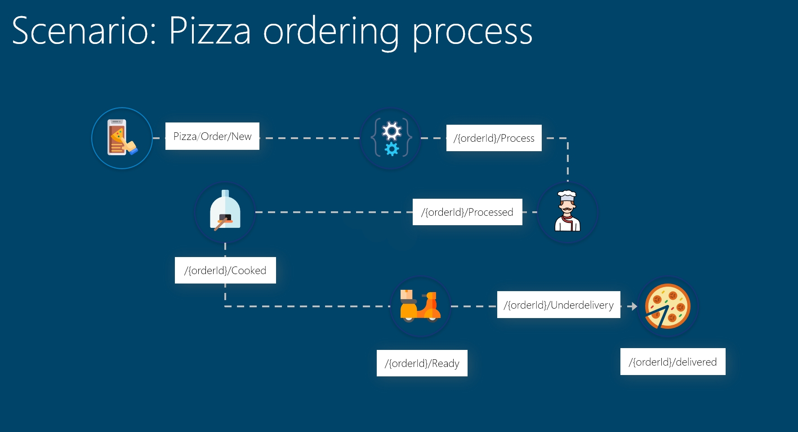

# Azure functions event grid demo

## Summary

A demo showing how to use Azure event grid custom topic and PowerShell Azure Functions. Each individual PowerShell function will subscribe to one event and post a new event. The intention is to replicate a business process. For the purpose of the demo, we are usin a Pizza order and delivery.

## How to install

The ARM template under .Infrastructure will deploy the infrastructure, including Azure function app and an event grid topic. At this point, the code and the individual event grid subscriptions are **not** deployed.
You can build and deploy the actutal functions code locally or using Azure DevOps (or what ever you use).

After the infrastructure and code is deployed, you will have to add an event grid subscription for each individual function. This can be done from the function it self.

For the demo to work please add the following event grid subscriptions

| Name  	| Type  	|   Subject prefix	|Subject suffix   |
|---	|---	|---	|---    |      
| 1-new-order  	|  PizzaOrder 	|   Order	| /New
| 2-process-order  	|   PizzaOrder	|   	| /Received      |           
| 3-bake-order  	|   PizzaOrder	|   	| /Processed      |
| 4-order-ready  	|   PizzaOrder	|   	| /Cooked      |
| 5-order-delivery  	|   PizzaOrder	|   	| /Ready      |

## How to run
please get your event grid key and toic URI. Then grab the script from .helpers folder to send your order (the first event).
Each function gets the connection (key and uri) from it's environment variables.

PS: if you want to read the events coming in real time. Please install Event Grid viewer. https://github.com/Azure-Samples/azure-event-grid-viewer

### PreReq
In order to use PowerShell for Azure Functions V2 you will have to onboard the public preview. https://docs.microsoft.com/en-us/azure/azure-functions/functions-create-first-function-powershell

### Future
Create a fully automated version. And add the event grid uri and SAS to KeyVault.
